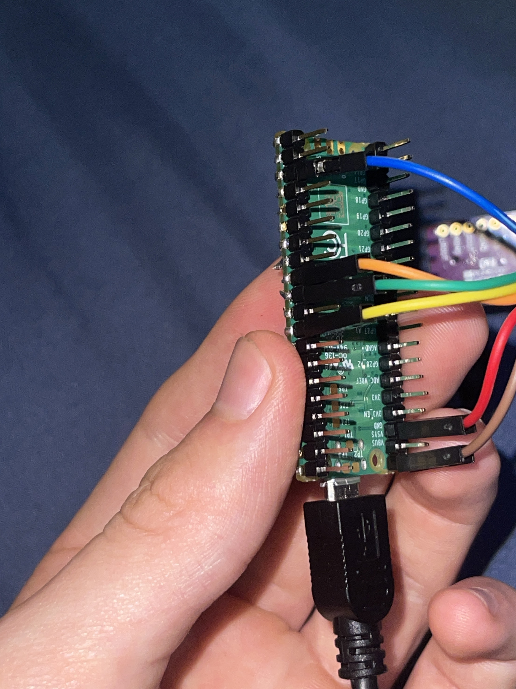

# Sine Wave on PCM1502 DAC
Adapted (_read: copied_) from https://github.com/malacalypse/rp2040_i2s_example
## Device: PCM1502
Can be found on Amazon:
https://www.amazon.com/dp/B08SLPHY2Z?ref_=ppx_hzsearch_conn_dt_b_fed_asin_title_1
## Pinout

_This is how I did the pinout. The pins on the breakout board are in order of the rainbow on the jumper cables, so pin VIN is brown, GND is red, etc etc_

| PCM1502 | PICO      | (GPIO) |
|---------|-----------|--------|
| VIN     | VBUS (5V) | --     |
| GND     | GND       | --     |
| LCK     | P12       | GP9    |
| DIN     | P9        | GP6    |
| BCK     | P11       | GP8    |
| SCK     | GND       | --     |

